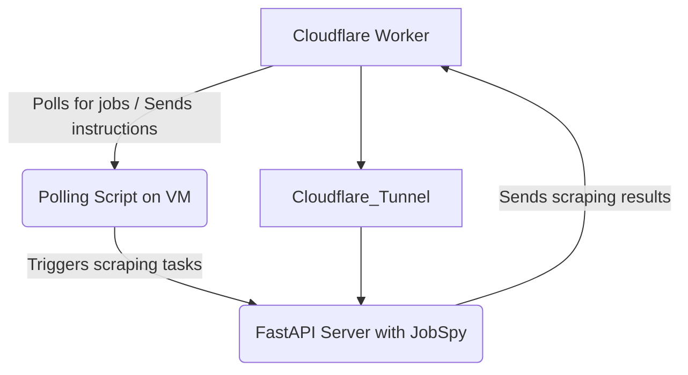

# Proposal: Integrating Local JobSpy Python Scraper with Cloudflare Worker via Systemd and Tunnel

This document outlines a proposal for deploying and managing the `jobspy` Python scraper on an Ubuntu Proxmox VM. The setup will involve a FastAPI server to expose the `jobspy` functionality, a Cloudflare Tunnel for secure external access, and a `systemd` service to ensure reliability and automatic startup. A key component will be a polling mechanism that allows the local Python script to communicate with the Cloudflare Worker to determine its operational mode (queued jobs vs. autonomous scraping).

---

### 1. Architecture Overview

The proposed architecture integrates the local Python scraper into the existing Cloudflare Workers ecosystem:

*   **Ubuntu Proxmox VM:** Hosts the `jobspy` Python application, FastAPI server, Cloudflare Tunnel, and `systemd` services.
*   **FastAPI Server:** A lightweight Python web server that wraps the `jobspy` scraping logic, exposing it via a REST API. This allows the Cloudflare Worker to trigger specific scraping tasks on the local VM.
*   **Cloudflare Tunnel:** Provides a secure, outbound-only connection from the VM to the Cloudflare network, making the FastAPI server accessible to the Cloudflare Worker without opening inbound firewall ports.
*   **Cloudflare Worker:** The central orchestrator. It will:
    *   Queue scraping jobs for the local Python script.
    *   Expose an endpoint that the local Python script can poll to check for new jobs or receive instructions.
    *   Receive results from the FastAPI server.
*   **Polling Script (Python):** A dedicated Python script running on the VM that periodically polls the Cloudflare Worker. Based on the Worker's response, it will either:
    *   Fetch and execute a queued job from the Worker.
    *   Initiate its own autonomous `jobspy` scraping tasks.
*   **Systemd Services:** Manages the FastAPI server, Cloudflare Tunnel, and the polling script, ensuring they start automatically on boot and restart if they crash.



---

### 2. Setup Steps

#### 2.1. Cloudflare Tunnel Configuration

1.  **Install `cloudflared`:** On the Ubuntu VM, install the Cloudflare Tunnel daemon.
    ```bash
    curl -L --output cloudflared.deb https://github.com/cloudflare/cloudflared/releases/latest/download/cloudflared-linux-amd64.deb
    sudo dpkg -i cloudflared.deb
    sudo cloudflared service install
    ```
2.  **Authenticate `cloudflared`:** Authenticate `cloudflared` with your Cloudflare account. This will open a browser window for login.
    ```bash
    cloudflared tunnel login
    ```
3.  **Create a Tunnel:** Create a named tunnel.
    ```bash
    cloudflared tunnel create jobspy-tunnel
    ```
4.  **Configure `config.yml`:** Create a `config.yml` file (e.g., in `/etc/cloudflared/`) for the tunnel, mapping a public hostname to the local FastAPI server.
    ```yaml
    # /etc/cloudflared/config.yml
    tunnel: <YOUR_TUNNEL_UUID>
    credentials-file: /root/.cloudflared/<YOUR_TUNNEL_UUID>.json
    ingress:
      - hostname: jobspy.<YOUR_DOMAIN>.com
        service: http://localhost:<FASTAPI_PORT>
      - service: http_status:404
    ```
    *   Replace `<YOUR_TUNNEL_UUID>` with the UUID from `cloudflared tunnel create`.
    *   Replace `<YOUR_DOMAIN>.com` with your actual domain.
    *   Replace `<FASTAPI_PORT>` with the port your FastAPI server will listen on (e.g., 8000).
5.  **DNS Record:** In your Cloudflare Dashboard, create a CNAME record for `jobspy.<YOUR_DOMAIN>.com` pointing to `<YOUR_TUNNEL_UUID>.cfargotunnel.com`.
6.  **Run the Tunnel (Systemd):** Configure `cloudflared` to run as a `systemd` service.
    ```bash
    sudo systemctl enable cloudflared
    sudo systemctl start cloudflared
    ```

#### 2.2. FastAPI Server for JobSpy

1.  **Project Structure:**
    ```
    /path/to/jobspy-server/
    ├── main.py
    ├── requirements.txt
    └── .env
    ```
2.  **`requirements.txt`:**
    ```
    fastapi
    uvicorn
    python-dotenv
    jobspy # Assuming jobspy is installed or available
    ```
3.  **`.env`:**
    ```
    FASTAPI_PORT=8000
    WORKER_API_URL=https://your-worker.workers.dev/api/v1/scrape-queue
    WORKER_API_KEY=your_worker_api_key
    ```
4.  **`main.py` (FastAPI application):**
    ```python
    from fastapi import FastAPI, HTTPException, Request
    from pydantic import BaseModel
    from dotenv import load_dotenv
    import os
    import asyncio
    import httpx
    # from jobspy import scrape_jobs # Assuming jobspy is installed

    load_dotenv()

    app = FastAPI()

    FASTAPI_PORT = int(os.getenv("FASTAPI_PORT", 8000))
    WORKER_API_URL = os.getenv("WORKER_API_URL")
    WORKER_API_KEY = os.getenv("WORKER_API_KEY")

    class ScrapeRequest(BaseModel):
        url: str
        job_id: str
        site_id: str

    class ScrapeResult(BaseModel):
        job_id: str
        status: str
        content: str = None
        error: str = None

    @app.post("/scrape")
    async def scrape_job(request: ScrapeRequest, http_request: Request):
        # Basic authentication for the FastAPI endpoint
        auth_header = http_request.headers.get("Authorization")
        if not auth_header or auth_header.replace("Bearer ", "") != WORKER_API_KEY:
            raise HTTPException(status_code=401, detail="Unauthorized")

        print(f"Received scrape request for URL: {request.url}")
        try:
            # Placeholder for actual jobspy scraping logic
            # Replace with your actual jobspy integration
            # Example:
            # jobs = scrape_jobs(site_name=[request.site_id], search_term="software engineer", results_wanted=1, urls=[request.url])
            # content = jobs.to_json() # Or extract specific content

            # Simulate scraping
            await asyncio.sleep(5) # Simulate network delay and processing
            content = f"Scraped content for {request.url} by local JobSpy."

            result = ScrapeResult(
                job_id=request.job_id,
                status="success",
                content=content
            )
            # Send result back to Cloudflare Worker
            await send_result_to_worker(result)
            return {"message": "Scraping initiated and result sent to worker."}
        except Exception as e:
            error_result = ScrapeResult(
                job_id=request.job_id,
                status="failed",
                error=str(e)
            )
            await send_result_to_worker(error_result)
            raise HTTPException(status_code=500, detail=str(e))

    async def send_result_to_worker(result: ScrapeResult):
        if not WORKER_API_URL or not WORKER_API_KEY:
            print("Worker API URL or Key not configured. Skipping sending results.")
            return

        headers = {"Authorization": f"Bearer {WORKER_API_KEY}", "Content-Type": "application/json"}
        async with httpx.AsyncClient() as client:
            try:
                response = await client.post(WORKER_API_URL, json=result.dict(), headers=headers, timeout=30.0)
                response.raise_for_status()
                print(f"Successfully sent scrape result for job {result.job_id} to worker.")
            except httpx.HTTPStatusError as e:
                print(f"Failed to send scrape result to worker: HTTP error {e.response.status_code} - {e.response.text}")
            except httpx.RequestError as e:
                print(f"Failed to send scrape result to worker: Request error - {e}")

    if __name__ == "__main__":
        import uvicorn
        uvicorn.run(app, host="0.0.0.0", port=FASTAPI_PORT)
    ```
5.  **Systemd Service for FastAPI:**
    ```ini
    # /etc/systemd/system/jobspy-fastapi.service
    [Unit]
    Description=JobSpy FastAPI Server
    After=network.target

    [Service]
    User=your_user # Replace with your actual user
    WorkingDirectory=/path/to/jobspy-server
    ExecStart=/usr/bin/python3 -m uvicorn main:app --host 0.0.0.0 --port 8000
    Restart=always
    EnvironmentFile=/path/to/jobspy-server/.env

    [Install]
    WantedBy=multi-user.target
    ```
    *   Replace `your_user` and `/path/to/jobspy-server` with your actual values.
    *   Ensure `uvicorn` is in your Python environment's path or use the full path to the executable.
    *   Reload systemd, enable, and start the service:
        ```bash
        sudo systemctl daemon-reload
        sudo systemctl enable jobspy-fastapi
        sudo systemctl start jobspy-fastapi
        ```

#### 2.3. Polling Script

1.  **`polling_script.py`:**
    ```python
    import httpx
    import asyncio
    import os
    from dotenv import load_dotenv
    import time

    load_dotenv()

    WORKER_POLLING_URL = os.getenv("WORKER_POLLING_URL", "https://your-worker.workers.dev/api/v1/poll-for-jobs")
    WORKER_API_KEY = os.getenv("WORKER_API_KEY")
    FASTAPI_SCRAPE_URL = os.getenv("FASTAPI_SCRAPE_URL", "http://localhost:8000/scrape") # Cloudflare Tunnel will route this
    POLLING_INTERVAL_SECONDS = int(os.getenv("POLLING_INTERVAL_SECONDS", 10))

    async def poll_worker():
        headers = {"Authorization": f"Bearer {WORKER_API_KEY}"}
        async with httpx.AsyncClient() as client:
            while True:
                try:
                    print(f"Polling worker at {WORKER_POLLING_URL}...")
                    response = await client.get(WORKER_POLLING_URL, headers=headers, timeout=10.0)
                    response.raise_for_status()
                    data = response.json()

                    if data.get("action") == "scrape_job" and data.get("job"):
                        job_to_scrape = data["job"]
                        print(f"Worker requested to scrape job: {job_to_scrape['job_id']} - {job_to_scrape['url']}")
                        await trigger_fastapi_scrape(job_to_scrape)
                    elif data.get("action") == "autonomous_scrape":
                        print("Worker requested autonomous scraping. Initiating local jobspy tasks...")
                        # Implement your autonomous jobspy scraping logic here
                        # Example:
                        # from jobspy import scrape_jobs
                        # jobs = scrape_jobs(site_name=["linkedin"], search_term="software engineer", results_wanted=5)
                        # print(f"Autonomous scraping found {len(jobs)} jobs.")
                        pass # Placeholder for autonomous scraping
                    else:
                        print("Worker response: No specific action or autonomous scraping requested.")

                except httpx.HTTPStatusError as e:
                    print(f"Polling failed: HTTP error {e.response.status_code} - {e.response.text}")
                except httpx.RequestError as e:
                    print(f"Polling failed: Request error - {e}")
                except Exception as e:
                    print(f"An unexpected error occurred during polling: {e}")

                await asyncio.sleep(POLLING_INTERVAL_SECONDS)

    async def trigger_fastapi_scrape(job_data: dict):
        headers = {"Authorization": f"Bearer {WORKER_API_KEY}", "Content-Type": "application/json"}
        payload = {
            "url": job_data["url"],
            "job_id": job_data["job_id"],
            "site_id": job_data.get("site_id", "unknown")
        }
        async with httpx.AsyncClient() as client:
            try:
                response = await client.post(FASTAPI_SCRAPE_URL, json=payload, headers=headers, timeout=60.0)
                response.raise_for_status()
                print(f"Successfully triggered FastAPI scrape for job {job_data['job_id']}.")
            except httpx.HTTPStatusError as e:
                print(f"Failed to trigger FastAPI scrape: HTTP error {e.response.status_code} - {e.response.text}")
            except httpx.RequestError as e:
                print(f"Failed to trigger FastAPI scrape: Request error - {e}")

    if __name__ == "__main__":
        asyncio.run(poll_worker())
    ```
2.  **`.env` (for polling script):**
    ```
    WORKER_POLLING_URL=https://your-worker.workers.dev/api/v1/poll-for-jobs
    WORKER_API_KEY=your_worker_api_key
    FASTAPI_SCRAPE_URL=http://localhost:8000/scrape # Or the Cloudflare Tunnel URL if polling script needs to use it
    POLLING_INTERVAL_SECONDS=10
    ```
3.  **Systemd Service for Polling Script:**
    ```ini
    # /etc/systemd/system/jobspy-polling.service
    [Unit]
    Description=JobSpy Polling Script
    After=network.target jobspy-fastapi.service # Ensure FastAPI is up

    [Service]
    User=your_user # Replace with your actual user
    WorkingDirectory=/path/to/jobspy-server # Or a separate directory for the polling script
    ExecStart=/usr/bin/python3 polling_script.py
    Restart=always
    EnvironmentFile=/path/to/jobspy-server/.env # Or separate .env for polling script

    [Install]
    WantedBy=multi-user.target
    ```
    *   Reload systemd, enable, and start the service:
        ```bash
        sudo systemctl daemon-reload
        sudo systemctl enable jobspy-polling
        sudo systemctl start jobspy-polling
        ```

#### 2.4. Cloudflare Worker Updates

1.  **Expose Polling Endpoint:** Add a new endpoint (e.g., `/api/v1/poll-for-jobs`) to your Cloudflare Worker. This endpoint will be called by the `polling_script.py`.
    *   This endpoint should check a queue (e.g., Cloudflare Queue, D1 table) for pending jobs for the local scraper.
    *   If a job is found, return an action `scrape_job` with job details.
    *   If no jobs are queued, return an action `autonomous_scrape` to instruct the local script to perform its own scraping, or `no_action`.

    ```typescript
    // src/index.ts (example)
    import { Hono } from 'hono';
    import { Env } from './types'; // Assuming you have an Env type

    const app = new Hono<Env>();

    // ... other routes ...

    app.get('/api/v1/poll-for-jobs', async (c) => {
        // Implement logic to check for queued jobs for the local scraper
        // Example: Check a D1 table or a Cloudflare Queue
        const queuedJob = await c.env.DB.prepare('SELECT * FROM local_scraper_queue WHERE status = ? LIMIT 1')
                                      .bind('pending')
                                      .first();

        if (queuedJob) {
            // Mark job as assigned/in-progress
            await c.env.DB.prepare('UPDATE local_scraper_queue SET status = ? WHERE job_id = ?')
                          .bind('assigned', queuedJob.job_id)
                          .run();
            return c.json({ action: 'scrape_job', job: queuedJob });
        } else {
            // No queued jobs, instruct for autonomous scraping or no action
            return c.json({ action: 'autonomous_scrape' }); // Or 'no_action'
        }
    });

    app.post('/api/v1/scrape-queue', async (c) => {
        // Endpoint to receive results from the FastAPI server
        const authHeader = c.req.header('Authorization');
        if (!authHeader || authHeader !== `Bearer ${c.env.WORKER_API_KEY}`) {
            return c.json({ error: 'Unauthorized' }, 401);
        }

        const result = await c.req.json();
        console.log('Received scrape result from local scraper:', result);

        // Process the result (e.g., update D1, store in R2)
        // Example: Update the status of the job in the D1 database
        await c.env.DB.prepare('UPDATE jobs SET status = ?, content = ? WHERE id = ?')
                      .bind(result.status, result.content, result.job_id)
                      .run();

        return c.json({ success: true, message: 'Result processed' });
    });

    // ... export app ...
    ```
2.  **Update `wrangler.toml`:** Ensure `WORKER_API_KEY` is defined as a secret.

---

### 3. Security Considerations

*   **API Keys:** Use strong, unique API keys for authentication between the Worker and FastAPI, and for the polling script. Store them as Cloudflare Worker secrets and in `.env` files on the VM, ensuring `.env` is not committed to version control.
*   **Cloudflare Tunnel:** The tunnel provides a secure, encrypted connection, eliminating the need to open inbound ports on the VM's firewall.
*   **FastAPI Authentication:** Implement basic token-based authentication for the FastAPI `/scrape` endpoint to ensure only authorized requests from your Worker are processed.
*   **Least Privilege:** Configure `systemd` services to run under a dedicated, non-root user with minimal necessary permissions.

---

### 4. Advantages

*   **Hybrid Scraping:** Combines the power of local `jobspy` (potentially with more complex browser automation or specific local dependencies) with the scalability and orchestration of Cloudflare Workers.
*   **Cost-Effective:** Offloads heavy browser rendering tasks from the Worker to a dedicated VM, potentially reducing Worker execution time and costs for certain scraping profiles.
*   **Resilience:** `systemd` ensures the services are always running, and the polling mechanism provides a robust way for the local script to receive tasks.
*   **Secure Access:** Cloudflare Tunnel provides secure, managed access to the local server without complex firewall rules.

---

### 5. Future Enhancements

*   **Dynamic Polling Interval:** Allow the Worker to dynamically adjust the `POLLING_INTERVAL_SECONDS` based on queue depth or system load.
*   **Job Prioritization:** Implement job prioritization in the Worker's queue to ensure critical scraping tasks are handled first.
*   **Error Reporting:** Enhance error reporting from the FastAPI server back to the Worker, including detailed stack traces or logs.
*   **Configuration Management:** Centralize `jobspy` configurations (e.g., sites to scrape autonomously) in a D1 database or KV store, allowing the Worker to push updates to the local script.
*   **Health Checks:** Implement health check endpoints on the FastAPI server that the Worker can periodically call to monitor the local scraper's status.
