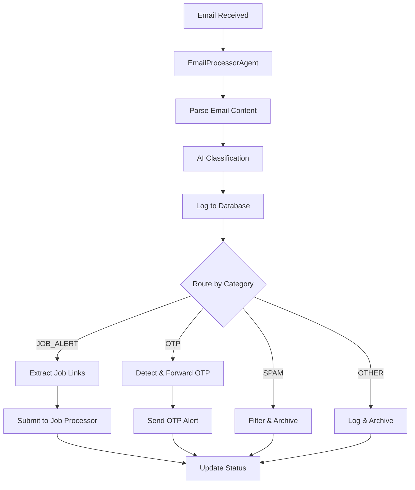

# Cloudflare Agents SDK - Email Processor Agent

## 📧 **EmailProcessorAgent Overview**

The `EmailProcessorAgent` is a powerful Cloudflare Agents SDK-based email processing system that replaces the previous modular approach with a single, comprehensive agent. This agent handles all aspects of email processing including parsing, AI classification, job link extraction, OTP detection, and centralized job processing.

## 🏗️ **Architecture**

### **Agent-Based Processing Flow:**



### **Key Features:**

- ✅ **AI-Powered Classification** using Workers AI with structured JSON output
- ✅ **Automatic Job Link Extraction** and processing
- ✅ **OTP Detection & Forwarding** with email notifications
- ✅ **Centralized Database Logging** to `email_logs` table
- ✅ **Error Handling & Fallbacks** for robust processing
- ✅ **Stateful Processing** using Durable Objects

## 🚀 **Usage**

### **Basic Usage:**

```typescript
// In your main worker
export default {
  async email(
    message: ForwardableEmailMessage,
    env: Env,
    ctx: ExecutionContext
  ): Promise<void> {
    try {
      // Create a new agent instance
      const agentId = env.EMAIL_PROCESSOR_AGENT.newUniqueId();
      const agent = env.EMAIL_PROCESSOR_AGENT.get(agentId);

      // Process the email
      await agent.email(message, env);
    } catch (error) {
      console.error("❌ Email processing failed:", error);
      // Fallback to original processing if needed
    }
  },
};
```

### **Agent Configuration:**

```typescript
// wrangler.toml
[durable_objects];
bindings = [
  { name = "EMAIL_PROCESSOR_AGENT", class_name = "EmailProcessorAgent" },
][[migrations]];
tag = "v4";
new_sqlite_classes = ["EmailProcessorAgent"];
```

## 🤖 **AI Classification**

### **Supported Categories:**

| Category         | Description                    | Action                      |
| ---------------- | ------------------------------ | --------------------------- |
| `JOB_ALERT`      | Job board notifications        | Extract & process job links |
| `OTP`            | One-time passwords             | Detect & forward codes      |
| `RECRUITER`      | Direct recruiter outreach      | Log & archive               |
| `NETWORKING`     | Professional networking        | Log & archive               |
| `MESSAGE`        | Personal/professional messages | Log & archive               |
| `SYSTEM`         | System notifications           | Log & archive               |
| `SPAM`           | Malicious content              | Filter & reject             |
| `MARKETING_SPAM` | Promotional emails             | Filter & archive            |
| `UNKNOWN`        | Unclassified emails            | Log & archive               |

### **AI Prompt Engineering:**

The agent uses a sophisticated prompt system that:

- Analyzes email headers, text, and HTML content
- Extracts job posting URLs using pattern matching
- Provides structured JSON responses with reasoning
- Handles edge cases and error scenarios

## 🔗 **Job Processing Integration**

### **Automatic Job Link Processing:**

When emails are classified as `JOB_ALERT`, the agent:

1. **Extracts job URLs** from email content
2. **Submits to centralized processor** via `submitJobUrlsForProcessing()`
3. **Updates `email_job_links` table** with processing results
4. **Tracks success/failure** for each URL

### **Job URL Patterns Detected:**

- LinkedIn: `/jobs/view/`
- Indeed: `/viewjob?jk=`
- Glassdoor: `/job-listing/`
- Company sites: `/careers/`, `/jobs/`, `/opportunities/`
- Generic patterns containing "job", "position", "opening", "hiring"

## 🔐 **OTP Detection & Forwarding**

### **OTP Code Patterns:**

The agent detects OTP codes using regex patterns:

- `(?:code|otp|verification|pin)[\s:]*(\d{4,8})`
- `(\d{4,8})[\s]*(?:is your|is the|verification|code)`
- `(?:enter|use|type)[\s]*(?:code|otp)[\s:]*(\d{4,8})`

### **OTP Forwarding:**

When OTP codes are detected:

1. **Extracts the code** from email content
2. **Sends notification email** to configured recipient
3. **Logs the forwarding** in database
4. **Tracks success/failure** of forwarding

## 🗄️ **Database Integration**

### **Centralized Logging:**

All emails are logged to the `email_logs` table with:

```sql
-- Core email data
id, uuid, from_email, to_email, subject, message_id, date_received

-- Content
content_text, content_html, content_preview, headers

-- AI Classification
ai_from, ai_subject, ai_body, ai_category, ai_category_reasoning, ai_job_links
ai_processed_at, ai_processing_status

-- Job Processing
job_links_extracted, jobs_processed

-- OTP Handling
otp_detected, otp_code, otp_forwarded_to

-- Status & Timestamps
status, received_at, processed_at, created_at, updated_at
```

### **Job Links Tracking:**

Job URLs are tracked in `email_job_links` table:

- Links each URL to the source email
- Tracks processing status and results
- Stores job IDs when successfully processed
- Records errors for failed processing

## ⚙️ **Configuration**

### **Required Environment Variables:**

```bash
# AI Model for email classification
DEFAULT_MODEL_REASONING="@cf/meta/llama-3.3-70b-instruct-fp8-fast"

# OTP forwarding (optional)
OTP_FORWARD_EMAIL="your-email@example.com"

# Email sender for notifications
EMAIL_SENDER="noreply@yourdomain.com"
```

### **Optional Configuration:**

```bash
# Custom AI model (if different from default)
DEFAULT_MODEL_REASONING="@cf/meta/llama-3.1-8b-instruct"

# Custom OTP forwarding email
OTP_FORWARD_EMAIL="otp-alerts@yourdomain.com"
```

## 🧪 **Testing**

### **Run Email Agent Tests:**

```bash
# Test the email agent specifically
pnpm test:email-agent

# Run all email tests
pnpm test:email

# Run comprehensive test suite
pnpm test:comprehensive
```

### **Test Coverage:**

- ✅ Agent initialization and configuration
- ✅ Email parsing and content extraction
- ✅ AI classification and structured output
- ✅ Database logging and status updates
- ✅ Job processing integration
- ✅ OTP detection and forwarding
- ✅ Error handling and fallbacks

## 🔍 **Monitoring & Debugging**

### **Logging:**

```typescript
// Agent provides detailed logging
console.log(`📧 Email received from: ${message.from}`);
console.log(`🧠 AI classification: ${classification.category}`);
console.log(`🔗 Job links found: ${jobLinks.length}`);
console.log(`🔑 OTP detected: ${otpCode}`);
console.log(`✅ Processing completed: ${status}`);
```

### **Database Queries:**

```sql
-- Check email processing status
SELECT ai_category, COUNT(*) as count
FROM email_logs
WHERE received_at > datetime('now', '-1 day')
GROUP BY ai_category;

-- Check job processing results
SELECT status, COUNT(*) as count
FROM email_job_links
WHERE created_at > datetime('now', '-1 day')
GROUP BY status;

-- Check OTP forwarding
SELECT otp_detected, COUNT(*) as count
FROM email_logs
WHERE received_at > datetime('now', '-1 day')
GROUP BY otp_detected;
```

## 🚨 **Error Handling**

### **Fallback Mechanisms:**

1. **Agent Failure**: Falls back to original email processing
2. **AI Classification Failure**: Uses default category with error logging
3. **Database Errors**: Logs errors and continues processing
4. **Job Processing Failure**: Records errors in `email_job_links` table
5. **OTP Forwarding Failure**: Logs errors and continues processing

### **Error Recovery:**

- All errors are logged with timestamps
- Failed operations are retried where appropriate
- Database transactions ensure data consistency
- Email rejection prevents infinite loops

## 📈 **Performance**

### **Optimizations:**

- **Efficient AI calls** with structured output
- **Batch job processing** for multiple URLs
- **Minimal database queries** with proper indexing
- **Async processing** for non-blocking operations
- **Resource cleanup** after processing

### **Scaling:**

- **Durable Object isolation** for concurrent emails
- **Automatic scaling** based on email volume
- **Resource limits** prevent overconsumption
- **Queue-based processing** for job URLs

## 🔄 **Migration from Old System**

### **Deprecated Modules:**

- ❌ `src/lib/email/parsing.ts` - Replaced by agent parsing
- ❌ `src/lib/email/otp-handling.ts` - Replaced by agent OTP handling
- ❌ Manual email processing - Replaced by agent automation

### **Migration Benefits:**

- ✅ **Single entry point** for all email processing
- ✅ **Consistent AI classification** across all emails
- ✅ **Automatic job processing** without manual intervention
- ✅ **Centralized logging** and monitoring
- ✅ **Better error handling** and recovery
- ✅ **Future extensibility** for complex workflows

## 📚 **Additional Resources**

- **Email System Guide**: `src/lib/email/AGENTS.md`
- **Deprecated Modules**: `src/lib/email/DEPRECATED_MODULES.md`
- **Cloudflare Agents SDK**: [Official Documentation](https://developers.cloudflare.com/agents/)
- **Workers AI**: [AI Documentation](https://developers.cloudflare.com/workers-ai/)

---

**🎯 The EmailProcessorAgent provides a comprehensive, AI-powered email processing solution that consolidates all email functionality into a single, powerful agent.**
