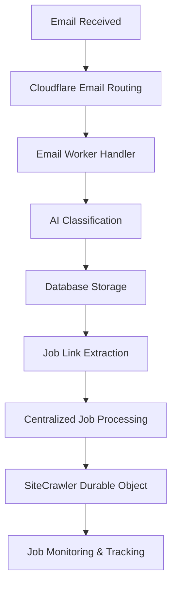

# Email Services - Agent Instructions

This document provides comprehensive instructions for AI agents working on the 9to5-scout email system. It covers the architecture, processing flow, Cloudflare Email Routing integration, and implementation details.

## 📧 **Email System Overview**

The 9to5-scout email system is a sophisticated AI-powered email processing pipeline that automatically classifies incoming emails, extracts job posting links, and integrates with the centralized job processing infrastructure.

### **Key Features:**

- **AI-Powered Classification**: Every email is analyzed by AI to determine category and extract structured data
- **Job Link Extraction**: Automatically finds and processes job posting URLs
- **Centralized Processing**: All job URLs are sent to the main job processing pipeline
- **Multiple Submission Methods**: WebSocket API, REST API, and direct email processing
- **Cloudflare Email Routing**: Native integration with Cloudflare's email infrastructure

## 🏗️ **Architecture & Integration**

### **Email Processing Flow:**



### **Integration Points:**

1. **Cloudflare Email Routing**: Receives emails via MX records
2. **Email Workers**: Processes emails with custom logic
3. **AI Classification**: Uses Workers AI for email analysis
4. **Database Storage**: Stores email data in D1
5. **Job Processing**: Integrates with existing Durable Objects and Workflows

## 🔧 **Cloudflare Email Routing Setup**

### **Configuration Requirements:**

#### **1. Email Routing Domain Setup**

```bash
# Enable Email Routing for your domain
# Go to: Email > Email Routing > Get Started
# Add MX records to your domain DNS
```

#### **2. Email Worker Configuration**

```toml
# wrangler.toml
[email_workers]
# Email Worker is automatically created when you enable Email Routing
# No additional configuration needed in wrangler.toml
```

#### **3. Email Binding in Worker**

```typescript
// The email handler is automatically available in your Worker
export default {
  async email(
    message: ForwardableEmailMessage,
    env: Env,
    ctx: ExecutionContext
  ) {
    // Process incoming email
    await processEmailEvent(message, env);
  },
};
```

### **Cloudflare Email Routing API:**

#### **ForwardableEmailMessage Interface:**

```typescript
interface ForwardableEmailMessage {
  readonly from: string; // Sender email address
  readonly to: string; // Recipient email address
  readonly headers: Headers; // Email headers
  readonly raw: ReadableStream; // Raw email content
  readonly rawSize: number; // Email size in bytes

  setReject(reason: string): void; // Reject email
  forward(rcptTo: string, headers?: Headers): Promise<void>; // Forward email
  reply(message: EmailMessage): Promise<void>; // Reply to sender
}
```

#### **EmailMessage Interface (for sending):**

```typescript
interface EmailMessage {
  readonly from: string;
  readonly to: string;
  readonly raw: ReadableStream | string;
}
```

## 📁 **File Structure**

```
src/lib/email/
├── AGENTS.md                 # This file - agent instructions
├── index.ts                  # Main email module exports
├── types.ts                  # Consolidated email type definitions
├── ai-classification.ts      # AI-powered email classification
├── parsing.ts               # Email parsing and content extraction
├── job-extraction.ts        # Job URL extraction and processing
├── otp-handling.ts          # OTP detection and forwarding
├── templates.ts             # Email template generation
├── utils.ts                 # Email utility functions
├── insights.ts              # Email insights and analytics
├── search.ts                # Email search functionality
└── events.ts                # Email event processing

src/routes/email/
├── index.ts                 # Email route exports
├── basic-email.ts           # Basic email processing
├── enhanced-email.ts        # Enhanced email processing
├── ai-email.ts              # AI-powered email processing
└── management.ts            # Email management APIs
```

## 🤖 **AI Classification System**

### **Email Categories:**

- `SPAM` - Unwanted or malicious emails
- `JOB_ALERT` - Job posting notifications
- `MESSAGE` - Personal or business messages
- `RECRUITER` - Direct recruiter communications
- `NETWORKING` - Professional networking emails
- `MARKETING_SPAM` - Marketing emails
- `OTP` - One-time password codes
- `SYSTEM` - System-generated emails
- `UNKNOWN` - Unclassified emails

### **AI Classification Process:**

```typescript
// 1. Extract email content
const emailContent = await extractEmailContent(message);

// 2. Classify with AI
const classification = await classifyEmailWithAI(env, emailContent, headers);

// 3. Store results
await saveEmailClassification(env, emailId, classification);

// 4. Process job links if found
if (classification.job_links.length > 0) {
  await submitJobLinksForProcessing(env, classification.job_links, emailId);
}
```

## 🔗 **Job Processing Integration**

### **Centralized Job Processing:**

All job URLs extracted from emails are sent to the centralized job processing system:

```typescript
// Submit job URLs for processing
const result = await submitJobUrlsForProcessing(env, {
  urls: jobLinks,
  source: "email",
  source_id: emailId.toString(),
  metadata: { email_classification: classification },
});
```

### **Processing Methods:**

#### **1. WebSocket API:**

```javascript
// Real-time job submission via WebSocket
ws.send(
  JSON.stringify({
    type: "job-processing",
    urls: ["https://example.com/job1"],
    source: "email",
    source_id: "123",
    metadata: { email_id: 123 },
  })
);
```

#### **2. REST API:**

```bash
# Submit job URLs via REST API
curl -X POST https://your-worker.workers.dev/api/job-processing/submit \
  -H "Content-Type: application/json" \
  -d '{
    "urls": ["https://example.com/job1"],
    "source": "email",
    "source_id": "123"
  }'
```

#### **3. Direct Integration:**

```typescript
// Direct function call from email processing
await submitJobUrlsForProcessing(env, {
  urls: classification.job_links,
  source: "email",
  source_id: emailId.toString(),
});
```

## 🗄️ **Database Schema**

### **Centralized Email Logs Table:**

```sql
CREATE TABLE email_logs (
  -- Primary key and identification
  id INTEGER PRIMARY KEY AUTOINCREMENT,
  uuid TEXT UNIQUE NOT NULL,

  -- Basic email information
  from_email TEXT NOT NULL,
  to_email TEXT,
  subject TEXT,
  message_id TEXT,
  date_received TEXT,

  -- Email content
  content_text TEXT,
  content_html TEXT,
  content_preview TEXT,
  headers TEXT, -- JSON string of all headers

  -- Job processing tracking
  job_links_extracted INTEGER DEFAULT 0,
  jobs_processed INTEGER DEFAULT 0,

  -- AI classification fields
  ai_from TEXT,
  ai_subject TEXT,
  ai_body TEXT,
  ai_category TEXT CHECK(ai_category IN ('SPAM', 'JOB_ALERT', 'MESSAGE', 'RECRUITER', 'NETWORKING', 'MARKETING_SPAM', 'OTP', 'SYSTEM', 'UNKNOWN')),
  ai_category_reasoning TEXT,
  ai_job_links TEXT, -- JSON array of extracted job URLs
  ai_processed_at TEXT,
  ai_processing_status TEXT DEFAULT 'pending' CHECK(ai_processing_status IN ('pending', 'processing', 'completed', 'failed')),

  -- Embeddings and semantic search
  embeddings_id TEXT, -- UUID for embeddings storage
  embeddings_vector TEXT, -- JSON array of embedding values for semantic search

  -- OTP detection and forwarding
  otp_detected BOOLEAN DEFAULT 0,
  otp_code TEXT,
  otp_forwarded_to TEXT,

  -- Status and timestamps
  status TEXT NOT NULL DEFAULT 'pending',
  received_at TEXT DEFAULT CURRENT_TIMESTAMP,
  processed_at TEXT,
  created_at TEXT DEFAULT CURRENT_TIMESTAMP,
  updated_at TEXT DEFAULT CURRENT_TIMESTAMP
);
```

### **Email Job Links Table:**

```sql
CREATE TABLE email_job_links (
  id INTEGER PRIMARY KEY AUTOINCREMENT,
  email_id INTEGER NOT NULL,
  job_url TEXT NOT NULL,
  status TEXT DEFAULT 'pending',
  job_id TEXT,
  processing_error TEXT,
  created_at DATETIME DEFAULT CURRENT_TIMESTAMP,
  updated_at DATETIME DEFAULT CURRENT_TIMESTAMP,
  FOREIGN KEY (email_id) REFERENCES email_logs(id)
);
```

### **Job Processing Queue Table:**

```sql
CREATE TABLE job_processing_queue (
  id TEXT PRIMARY KEY,
  url TEXT NOT NULL,
  source TEXT NOT NULL,
  source_id TEXT,
  status TEXT NOT NULL,
  job_id TEXT,
  error TEXT,
  metadata TEXT, -- JSON
  created_at DATETIME DEFAULT CURRENT_TIMESTAMP,
  updated_at DATETIME DEFAULT CURRENT_TIMESTAMP
);
```

## 🚀 **API Endpoints**

### **Email Processing:**

- `POST /api/email/ai-process` - AI-powered email processing
- `POST /api/email/routing-webhook` - Cloudflare Email Routing webhook

### **Job Processing:**

- `POST /api/job-processing/submit` - Submit job URLs for processing
- `GET /api/job-processing/status` - Check processing status

### **Email Management:**

- `GET /api/email/logs` - Get email logs
- `GET /api/email/configs` - Get email configurations
- `PUT /api/email/configs` - Update email configurations
- `POST /api/email/insights/send` - Send email insights

## 🔄 **Processing Workflow**

### **1. Email Reception:**

```typescript
// Email received via Cloudflare Email Routing
export default {
  async email(
    message: ForwardableEmailMessage,
    env: Env,
    ctx: ExecutionContext
  ) {
    try {
      // Forward to destination if needed
      await message.forward("destination@example.com");

      // Process with AI
      await processEmailEvent(message, env);
    } catch (error) {
      console.error("Email processing failed:", error);
      message.setReject("Email processing failed");
    }
  },
};
```

### **2. AI Classification:**

```typescript
// Classify email with AI
const classification = await classifyEmailWithAI(env, emailContent, headers);

// Expected response:
{
  from: "recruiter@company.com",
  subject: "New Software Engineer Position",
  body: "We have an exciting opportunity...",
  category: "JOB_ALERT",
  category_reasoning: "Email contains job posting details and application link",
  job_links: ["https://company.com/jobs/123"]
}
```

### **3. Job Processing:**

```typescript
// Submit job links to centralized processor
const result = await submitJobUrlsForProcessing(env, {
  urls: classification.job_links,
  source: "email",
  source_id: emailId.toString(),
  metadata: {
    email_classification: classification.category,
    email_subject: classification.subject,
  },
});
```

## 🛠️ **Development Guidelines**

### **Adding New Email Features:**

1. **Update Types**: Add new interfaces to `src/lib/email/types.ts`
2. **Implement Logic**: Create functions in appropriate module files
3. **Export Functions**: Add exports to `src/lib/email/index.ts`
4. **Add API Routes**: Create route handlers in `src/routes/email/`
5. **Update Database**: Add migrations for new database fields
6. **Test Integration**: Ensure job processing integration works

### **AI Classification Guidelines:**

- Always use structured JSON output with `response_format`
- Provide clear category descriptions in prompts
- Handle classification failures gracefully with fallbacks
- Log all AI interactions for debugging

### **Job Processing Guidelines:**

- Always use the centralized job processing service
- Never implement browser rendering in email modules
- Use appropriate source identifiers for tracking
- Handle batch processing efficiently

## 🔍 **Debugging & Monitoring**

### **Logging:**

```typescript
// Email processing logs
console.log(`📧 Email received from: ${message.from}`);
console.log(`🤖 AI classification: ${classification.category}`);
console.log(`🔗 Job links found: ${classification.job_links.length}`);
console.log(
  `✅ Job processing completed: ${result.processed_count} successful`
);
```

### **Error Handling:**

```typescript
try {
  await processEmailWithAIClassification(env, emailContent, headers);
} catch (error) {
  console.error("❌ Email processing failed:", error);
  // Log to database for debugging
  await logEmailProcessingError(env, emailId, error);
}
```

### **Monitoring Queries:**

```sql
-- Check email processing status
SELECT ai_category, COUNT(*) as count
FROM email_logs
WHERE received_at > datetime('now', '-1 day')
GROUP BY ai_category;

-- Check job processing status
SELECT status, COUNT(*) as count
FROM email_job_links
WHERE created_at > datetime('now', '-1 day')
GROUP BY status;
```

## 📚 **Cloudflare Email Documentation**

### **Key Resources:**

- [Email Routing Overview](https://developers.cloudflare.com/email-routing/)
- [Email Workers](https://developers.cloudflare.com/email-routing/email-workers/)
- [Runtime API](https://developers.cloudflare.com/email-routing/email-workers/runtime-api/)
- [Local Development](https://developers.cloudflare.com/email-routing/email-workers/local-development/)

### **Important Notes:**

- Email Workers are automatically created when you enable Email Routing
- No additional configuration needed in `wrangler.toml` for basic email handling
- Use `ForwardableEmailMessage` for incoming emails
- Use `EmailMessage` for sending emails
- Email forwarding requires verified destination addresses
- DMARC validation is required for email replies

## 🎯 **Best Practices**

1. **Always use AI classification** for consistent email processing
2. **Centralize job processing** - never duplicate browser rendering logic
3. **Handle errors gracefully** with proper fallbacks
4. **Log everything** for debugging and monitoring
5. **Use batch processing** for multiple job URLs
6. **Validate email content** before processing
7. **Test with real emails** during development
8. **Monitor processing queues** for bottlenecks

## 🚨 **Common Issues & Solutions**

### **Email Not Being Processed:**

- Check Email Routing configuration
- Verify MX records are correct
- Ensure email handler is properly exported
- Check Cloudflare dashboard for errors

### **AI Classification Failing:**

- Verify AI model configuration
- Check prompt formatting
- Ensure response format is JSON
- Review error logs for details

### **Job Processing Not Working:**

- Check centralized job processing service
- Verify WebSocket connections
- Ensure proper source identification
- Check database for processing status

---

This documentation provides everything an AI agent needs to understand and work with the 9to5-scout email system. Always refer to the Cloudflare documentation for the latest API changes and best practices.
